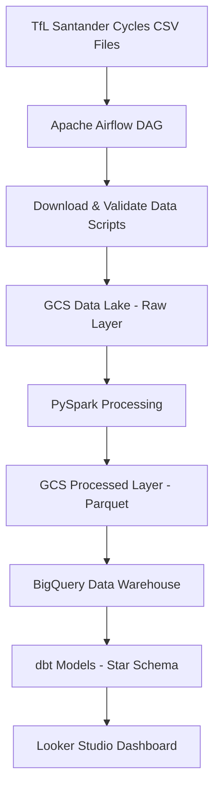
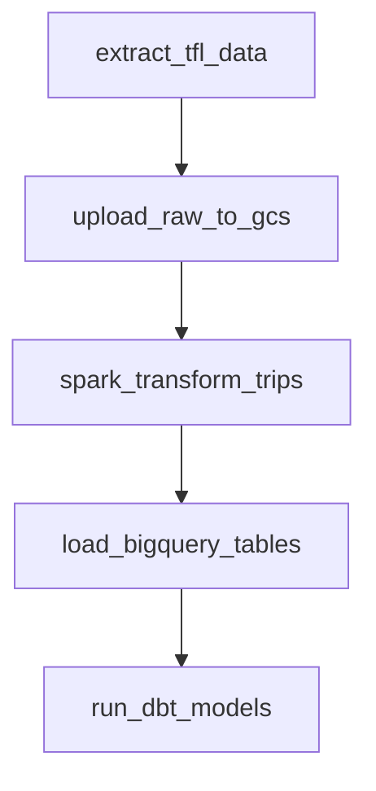
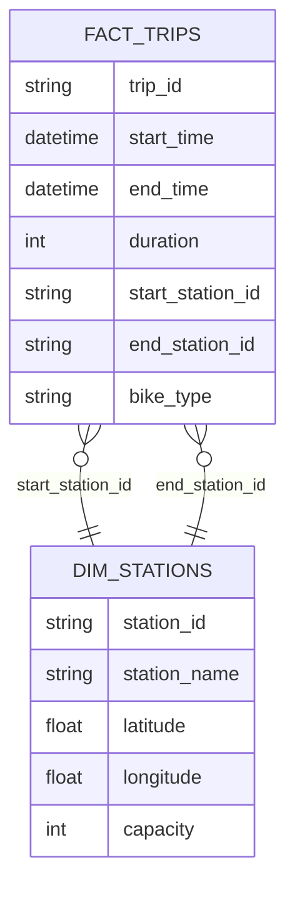

# 🚲 TfL Santander Cycles — Batch Data Pipeline

## Problem Statement

Transport for London publishes Santander Cycles trip data as a series of fragmented, historically versioned CSV files on a public web server.

While the data is publicly accessible, it is not directly usable for analysis at scale due to several engineering challenges:

- Files are spread across multiple URLs with no unified API
- Total data volume spans years of trip records across thousands of docking stations
- The schema changed in 2022 with the introduction of E-bikes, breaking naive ingestion approaches
- Raw CSV files are unpartitioned and cannot be queried efficiently

This project builds a fully automated **batch data pipeline** that solves these challenges by ingesting, processing, and modelling three years of post-pandemic TfL data (2023–2025).

---

## Pipeline Architecture

The pipeline follows a modern data engineering architecture composed of
a cloud data lake, distributed processing layer, data warehouse, and
analytics layer.

### Conceptual Flow

TfL Santander Cycles trip data is published as fragmented CSV files on a public server.  
Apache Airflow orchestrates the ingestion and processing workflow.

The pipeline performs the following steps:

1. Download raw CSV trip data from the TfL data source
2. Upload raw datasets to the Google Cloud Storage data lake
3. Process and clean the data using PySpark
4. Convert CSV files into partitioned Parquet datasets
5. Load curated data into BigQuery
6. Transform data using dbt to create a star schema
7. Power analytics through a Looker Studio dashboard

### Architecture Diagram





## Infrastructure (Terraform + GCP)

Google Cloud infrastructure is provisioned using **Terraform** to ensure the platform is reproducible and version-controlled.

Resources include:

- **Google Cloud Storage (GCS)** — Data lake for raw and processed datasets  
- **BigQuery** — Data warehouse for analytics and reporting  

---


## Workflow Orchestration



An **Apache Airflow DAG** orchestrates the full batch pipeline:

1. Download CSV files from the TfL public data server  
2. Upload raw datasets to the GCS data lake  
3. Trigger PySpark transformation jobs  
4. Load curated datasets into BigQuery  
5. Execute dbt models to build analytics tables  

---

## Batch Processing (PySpark)

PySpark performs distributed processing on the raw datasets:

- Cleaning and validating trip records
- Standardising schemas across historical changes (including E-bike introduction)
- Converting CSV datasets into **partitioned Parquet files**
- Preparing optimized datasets for warehouse ingestion

---

## Data Warehouse (BigQuery + dbt)

Processed Parquet files are loaded into **BigQuery**.

Tables are optimized using:

- **Partitioning by trip date**
- **Clustering by station ID**

This improves performance for analytical queries used in dashboards.
---

## Data Model


A **Kimball-style star schema** is built using **dbt**:


- **fact_trips** — trip-level transactional records  
- **dim_stations** — docking station metadata  

---


## Tech Stack

| Layer | Technology |
|------|------------|
| Infrastructure | Terraform |
| Orchestration | Apache Airflow |
| Processing | PySpark |
| Data Lake | Google Cloud Storage |
| Data Warehouse | BigQuery |
| Transformations | dbt |
| Visualization | Looker Studio |

---

## Project Structure

```
london-bikes-data-engineering/
│
├── data_loader/
│   ├── dags/                     # Airflow DAG definitions
│   │   └── santander_pipeline.py
│   │
│   └── scripts/                  # Data ingestion scripts
│       ├── extract_tfl_data.py
│       └── upload_to_gcs.py
│
├── spark/                        # PySpark transformation jobs
│   └── transform_trips.py
│
├── dbt/                          # Analytics models
│   ├── models/
│   │   ├── staging/
│   │   └── marts/
│   └── dbt_project.yml
│
├── terraform/                    # Infrastructure as Code
│   ├── main.tf
│   ├── variables.tf
│   └── outputs.tf
│
├── docker-compose.yaml           # Local Airflow environment
├── commands.md                   # Useful project commands
├── .env                          # Environment variables
├── .gitignore
└── README.md
```

## Dashboard (Looker Studio)

The dashboard visualises system usage patterns and operational insights
for the Santander Cycles network.


The dashboard contains two tiles:

1. **Temporal Distribution**  
   Trip volume over time, highlighting peak demand periods.

2. **Categorical Distribution**  
   Net bike flow by station, identifying rebalancing hotspots and comparing **E-bike vs standard bike usage**.


---
