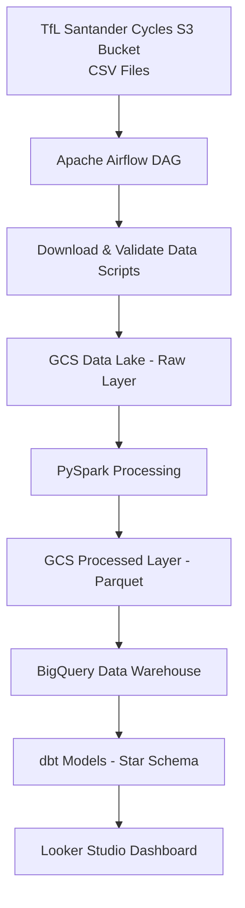
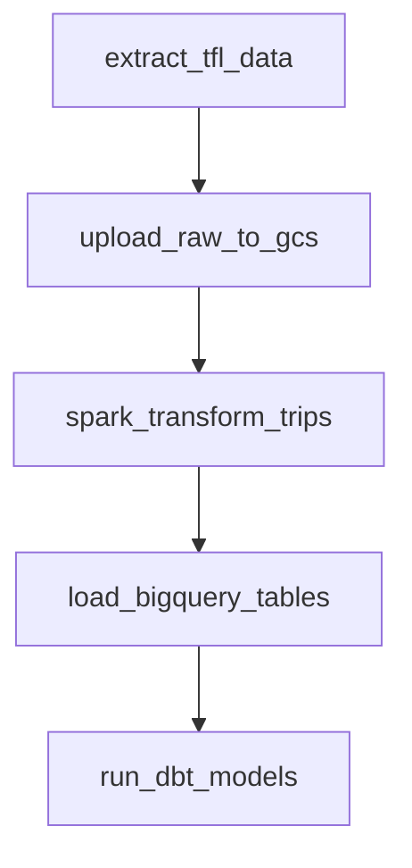
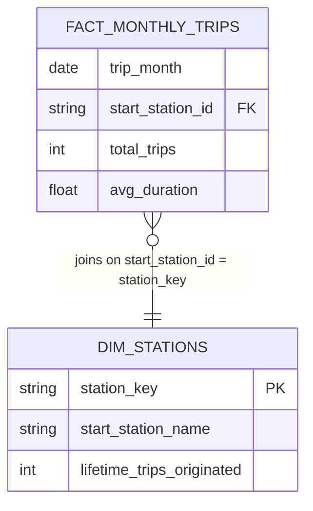
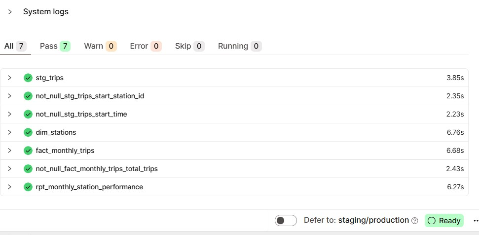
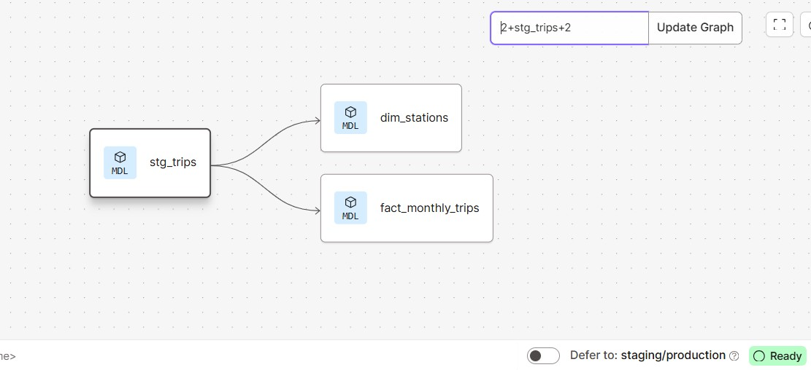

#  TfL Santander Cycles — Batch Data Pipeline

> Built a production-style Spark pipeline processing 100M+ bike trips, resolving schema drift, inconsistent timestamp formats, and data loss issues.

## Problem Statement

Transport for London publishes Santander Cycles trip data as a series of fragmented, historically versioned CSV files on a public web server.

While the data is publicly accessible, it is not directly usable for analysis at scale due to several engineering challenges:

- Files are spread across multiple URLs with no unified API
- Total data volume spans years of trip records across thousands of docking stations
- The schema changed in 2022 with the introduction of E-bikes, breaking naive ingestion approaches
- Raw CSV files are unpartitioned and cannot be queried efficiently

This project builds a fully automated batch data pipeline that ingests,
processes, and models the historical TfL Santander Cycles journey dataset
for large-scale analytics.

---
## Data Source

This project uses the **Santander Cycles journey dataset** published by Transport for London (TfL).

The dataset contains historical trip records for the Santander Cycles bike-sharing system in London.  
Each record represents a completed bike journey and includes information such as:

- Rental start and end times
- Start and end docking stations
- Trip duration
- Bike identifiers

The raw CSV files are publicly available through the TfL Open Data portal and are hosted in a public object storage bucket.

Data portal:  
https://cycling.data.tfl.gov.uk/

In this project, the ingestion pipeline queries the underlying storage API to automatically discover and download the available CSV files before processing them through the data pipeline.

Source: Transport for London Open Data

---
## Dataset Scale

The ingestion pipeline automatically discovers and downloads all available
CSV journey extracts from the TfL open data storage bucket.

The dataset processed in this project contains:

| Metric | Value |
|------|------|
| Raw files | **451 CSV files** |
| Raw dataset size | **~14 GB** |
| Processed dataset size | **~1.4 GB (Parquet)** |
| Total records | **105,707,738 trips** |
| Compression improvement | **~10× reduction** |

The raw dataset required schema detection and normalization across
historical exports before it could be used for analytics.

The pipeline standardizes column names, resolves data type inconsistencies,
and converts inefficient row-based CSV files into columnar Parquet datasets
optimized for large-scale analytical workloads.

---
## Pipeline Architecture

The pipeline follows a modern data engineering architecture composed of
a cloud data lake, distributed processing layer, data warehouse, and
analytics layer.

### Conceptual Flow

TfL Santander Cycles trip data is published as fragmented CSV files on a public server.  
Apache Airflow orchestrates the ingestion and processing workflow.

The pipeline performs the following steps:

1. Download raw CSV trip data from the TfL data source
2. Upload raw datasets to the Google Cloud Storage data lake
3. Process and clean the data using PySpark
4. Convert CSV files into partitioned Parquet datasets
5. Load curated data into BigQuery
6. Transform data using dbt to create a star schema
7. Power analytics through a Looker Studio dashboard

### Architecture Diagram



## ⚠️ Real-World Challenges & Solutions

This project involved handling several real-world data engineering issues that are commonly encountered in production pipelines.

---

### 1. Schema Drift in `duration_seconds`

**Problem**  
The `duration_seconds` column contained inconsistent formats across historical datasets:
- Numeric values (e.g. `360`)
- String values (e.g. `"1h 43m 42s"`)

This caused schema inference issues and broke aggregations.

**Solution**  
- Applied regex-based parsing to extract hours, minutes, and seconds  
- Converted all values into a unified numeric (seconds) format  
- Enforced consistent schema during transformation  

---

### 2. Inconsistent Timestamp Formats → Data Loss

**Problem**  
Multiple timestamp formats existed across files:
- `yyyy-MM-dd HH:mm:ss`
- `dd/MM/yyyy HH:mm`

Initial parsing produced **null timestamps**, which silently removed large portions of data (notably years 2023–2025).

**Solution**  
- Used `coalesce(to_timestamp(...))` across multiple formats  
- Standardised timestamps into a single format  
- Recovered missing records through reprocessing  

---

### 3. Silent Data Loss Detection

**Problem**  
Data appeared processed successfully, but entire year ranges were missing due to parsing failures.

**Solution**  
Implemented validation checks:
- Record counts before vs after transformations  
- Year-by-year distribution checks  
- Null value monitoring on critical columns  

---

### 4. Spark Performance & Stability Issues

**Problem**  
- Spark jobs occasionally hung due to resource constraints (WSL environment)  
- Long runtime (~1 hour)

**Solution**  
- Controlled partition sizes to reduce shuffle pressure  
- Used `.cache()` strategically for reused DataFrames  
- Ensured proper shutdown with `spark.stop()`  
- Identified and terminated orphaned Spark/Java processes  

---

### 5. Partitioning Strategy for Performance

**Problem**  
Raw CSV files were unpartitioned and inefficient for analytical queries.

**Solution**  
- Partitioned curated datasets by `year` and `month`  
- Improved query performance and reduced data scan size  

---

## Infrastructure (Terraform + GCP)

Google Cloud infrastructure is provisioned using **Terraform** to ensure the platform is reproducible and version-controlled.

Resources include:

- **Google Cloud Storage (GCS)** — Data lake for raw and processed datasets  
- **BigQuery** — Data warehouse for analytics and reporting  

---


## Workflow Orchestration



An **Apache Airflow DAG** orchestrates the full batch pipeline:

1. Download CSV files from the TfL public data server  
2. Upload raw datasets to the GCS data lake  
3. Trigger PySpark transformation jobs  
4. Load curated datasets into BigQuery  
5. Execute dbt models to build analytics tables  

---

## Batch Processing (PySpark)

PySpark performs distributed processing on the raw datasets:

- Cleaning and validating trip records
- Standardising schemas across historical changes (including E-bike introduction)
- Converting CSV datasets into **partitioned Parquet files**
- Preparing optimized datasets for warehouse ingestion

---

## Data Warehouse Optimization (BigQuery)

To handle **105 Million records** efficiently, I moved beyond a standard "flat" table approach. I implemented a **Native BigQuery Partitioning and Clustering** strategy directly within the PySpark write operation:

- **Native Partitioning (`start_time` by DAY):** I utilized BigQuery’s native ingestion-time partitioning on the `start_time` TIMESTAMP column. This enables **Partition Pruning**, allowing the query engine to physically skip data blocks that do not fall within the query's date range.
- **Clustering (`start_station_id`):** Data within each daily partition is physically sorted and re-organized by the `start_station_id`. This significantly optimizes high-cardinality filtering and station-level aggregations.

## Data Warehouse Performance Benchmarking
To verify the efficiency of the physical data model, I performed a baseline comparison across three stages of table optimization.

Test Query: Count total trips for a specific station on a specific day.
```sql
SELECT 
    start_station_id,
    COUNT(*) as trip_count,
    ROUND(AVG(duration_seconds), 2) as avg_duration_seconds,
    SUM(duration_seconds) as total_seconds
FROM YOUR_TABLE
WHERE start_time BETWEEN '2024-01-01 00:00:00' AND '2024-06-30 23:59:59'
  AND start_station_id = '251'
GROUP BY 1;
```

| Version            | Optimization Strategy        | Data Scanned (6-Month Query) | Performance Gain        |
|-------------------|-----------------------------|------------------------------|--------------------------|
| Stage 1: Raw      | None (Full Table Scan)      | 2.13 GB                      | Baseline                 |
| Stage 2: Partitioned | DAY(start_time)          | 94.84 MB                     | 95.5% Saved              |
| Stage 3: Clustered   | start_station_id         | 93.13 MB                     | 95.6% Total Saving       |


---
## 📊 Analytics Engineering with dbt

### Project Overview
This project transforms raw bicycle trip data into a clean, tested Star Schema ready for Analysis. The final pipeline processes approximately **105 Million rows** of historical trip data.

### Data Model (Star Schema)
I refactored the project structure into a dedicated `/dbt` subdirectory to follow mono-repo best practices. The models are organized into a standard layered architecture:

* **Staging (`stg_trips`):** Sanitizes inputs, casts data types, and filters out invalid records (e.g., trips missing `start_station_id`). This ensures the downstream models operate on trustworthy data.
* **Dimensions (`dim_stations`):** A unique list of all start and end stations, serving as the "Who" and "Where" of our analysis.
* **Facts (`fact_monthly_trips`):** The core metric table, aggregating trip counts, durations, and distinct station usage on a monthly grain.

### Pipeline Integrity & Testing
To ensure the 105M row dataset remains reliable, I implemented automated data quality tests in `schema.yml`. Every execution of the pipeline verifies:
* `not_null`: Ensures critical linking keys like `start_station_id` and `start_time` are populated.
* `unique`: Confirms the station dimension has no duplicate records.

### Lineage and Execution Success
The following image demonstrates the successful execution of the entire pipeline, including the green checkmarks for all model builds and data quality tests. This proves the end-to-end integrity of the 105M row transformation.


> **Pro-Tip:** Remember to replace `[YOUR-USERNAME]` and `[YOUR-REPO]` with your actual GitHub details!

---

### How to Reproduce this Project

#### Prerequisites
1.  A Google Cloud Project with BigQuery enabled.
2.  The raw London Bicycle Trips dataset loaded into a BigQuery dataset (e.g., `london_bicycles_raw`).
3.  A dbt Cloud account connected to your BigQuery project.

#### Execution Steps
1.  Clone this r---epository.
2.  In dbt Cloud, ensure your **Project Subdirectory** is set to `dbt`.
3.  Run the following command in the dbt Cloud IDE to build and test the entire Star Schema:
    ```bash
    dbt build
    ```
---
## Data Model




A **Kimball-style star schema** is built using **dbt**:

**fact_monthly_trips** — Monthly aggregates of trip volume and average duration.

**dim_stations** — Docking station metadata, including lifetime trips originated from each location.

---
### ✅ End-to-End dbt Pipeline Success: Staging to Analytics Marts
The following screenshot confirms that the dbt pipeline executed successfully in dbt Cloud, passing all schema tests and materializing the Star Schema in BigQuery.



### 📈 Modular dbt Architecture & Dependency Mapping
This lineage graph showcases the Medallion Architecture implemented in dbt, where raw data is decoupled into reusable components before being aggregated into a high-performance monthly station report


---

## Tech Stack

| Layer | Technology |
|------|------------|
| Infrastructure | Terraform |
| Orchestration | Apache Airflow |
| Processing | PySpark |
| Data Lake | Google Cloud Storage |
| Data Warehouse | BigQuery |
| Transformations | dbt |
| Visualization | Looker Studio |

---

## Project Structure

```
london-bikes-data-engineering/
│
├── data_loader/
│   ├── dags/                     # Airflow DAG definitions
│   │   └── tfl_bike_ingestion.py
│   │
│   └── scripts/                  # Data ingestion scripts
│       ├── extract_tfl_data.py
│       └── upload_to_gcs.py
│
├── spark/                        # PySpark transformation jobs
│   └── transform_trips.py
│
├── dbt/                          # Analytics models
│   ├── models/
│   │   ├── staging/
│   │   └── marts/
│   └── dbt_project.yml
│
├── terraform/                    # Infrastructure as Code
│   ├── main.tf
│   ├── variables.tf
│   └── outputs.tf
│
├── docker-compose.yaml           # Local Airflow environment
├── commands.md                   # Useful project commands
├── .env                          # Environment variables
├── .gitignore
└── README.md
```

## Dashboard (Looker Studio)

The dashboard visualises system usage patterns and operational insights
for the Santander Cycles network.


The dashboard contains two tiles:

1. **Temporal Distribution**  
   Trip volume over time, highlighting peak demand periods.

2. **Categorical Distribution**  
   Net bike flow by station, identifying rebalancing hotspots and comparing **E-bike vs standard bike usage**.


---
## Run the pipeline

1. Clone repo

git clone https://github.com/username/london-bikes-pipeline

2. Create environment

uv sync

3. Start services

docker compose up -d

4. Run terraform

terraform init
terraform apply

5. Run airflow DAG

open http://localhost:8080
