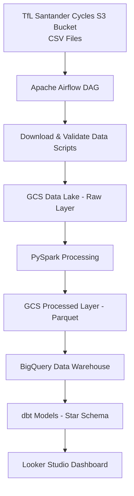
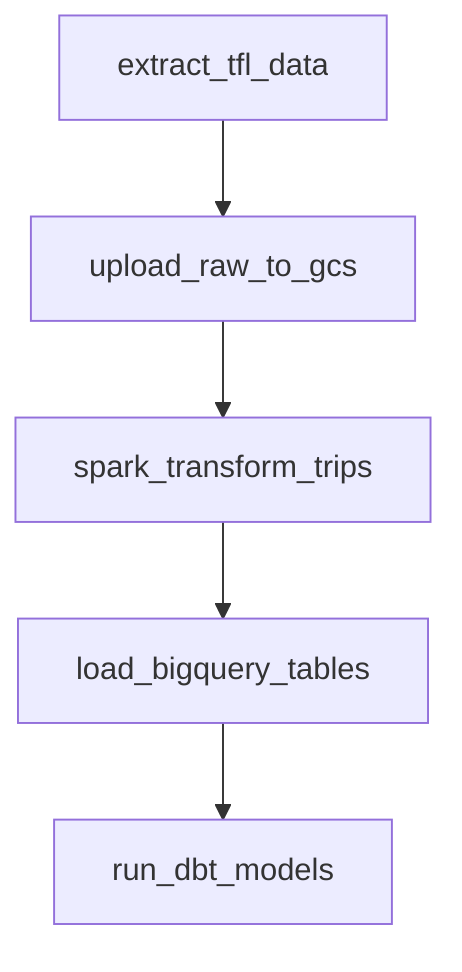
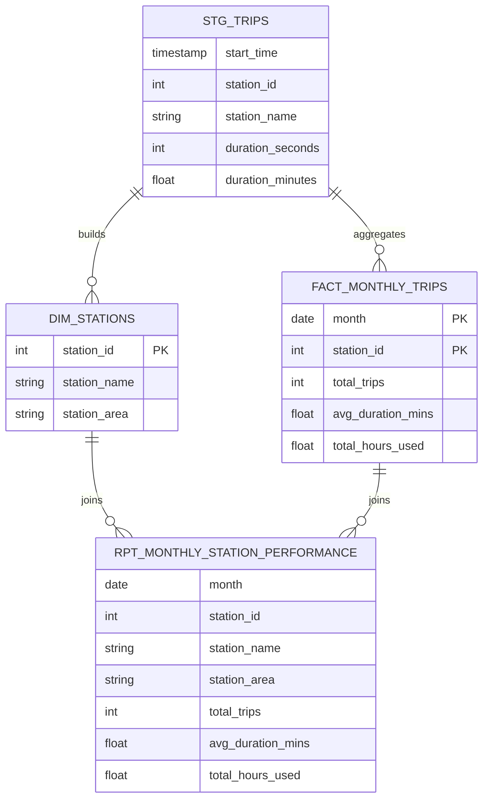
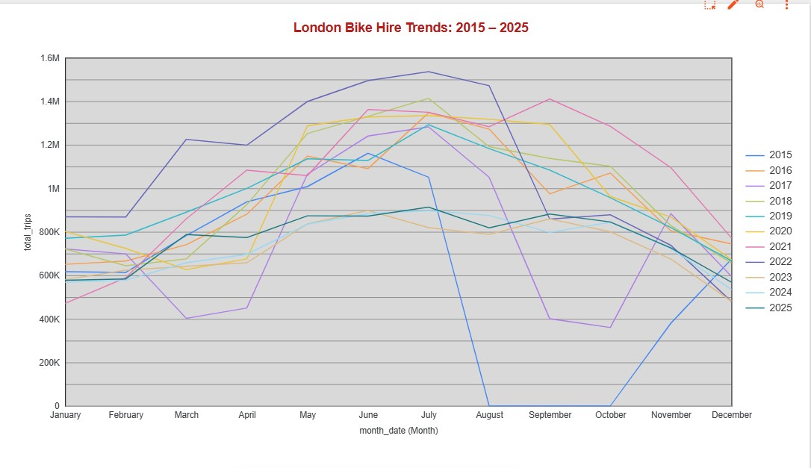
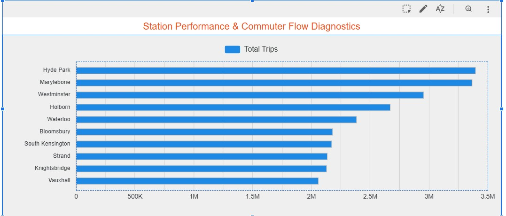
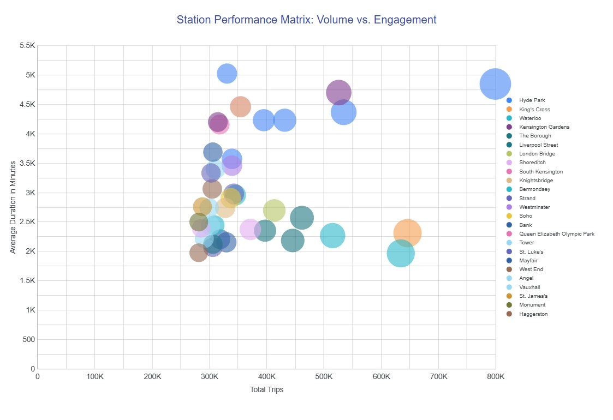

#  TfL Santander Cycles — Batch Data Pipeline

> Built a production-style Spark pipeline processing 100M+ bike trips, resolving schema drift, inconsistent timestamp formats, and data loss issues.

## Problem Statement

Transport for London publishes Santander Cycles trip data as a series of fragmented, historically versioned CSV files on a public web server.

While the data is publicly accessible, it is not directly usable for analysis at scale due to several engineering challenges:

- Files are spread across multiple URLs with no unified API
- Total data volume spans years of trip records across thousands of docking stations
- The schema changed in 2022 with the introduction of E-bikes, breaking naive ingestion approaches
- Raw CSV files are unpartitioned and cannot be queried efficiently

This project builds a fully automated batch data pipeline that ingests,
processes, and models the historical TfL Santander Cycles journey dataset
for large-scale analytics.

---
## Data Source

This project uses the **Santander Cycles journey dataset** published by Transport for London (TfL).

The dataset contains historical trip records for the Santander Cycles bike-sharing system in London.  
Each record represents a completed bike journey and includes information such as:

- Rental start and end times
- Start and end docking stations
- Trip duration
- Bike identifiers

The raw CSV files are publicly available through the TfL Open Data portal and are hosted in a public object storage bucket.

Data portal:  
https://cycling.data.tfl.gov.uk/

In this project, the ingestion pipeline queries the underlying storage API to automatically discover and download the available CSV files before processing them through the data pipeline.

Source: Transport for London Open Data

---
## Dataset Scale

The ingestion pipeline automatically discovers and downloads all available
CSV journey extracts from the TfL open data storage bucket.

The dataset processed in this project contains:

| Metric | Value |
|------|------|
| Raw files | **451 CSV files** |
| Raw dataset size | **~14 GB** |
| Processed dataset size | **~1.4 GB (Parquet)** |
| Total records | **105,707,738 trips** |
| Compression improvement | **~10× reduction** |

The raw dataset required schema detection and normalization across
historical exports before it could be used for analytics.

The pipeline standardizes column names, resolves data type inconsistencies,
and converts inefficient row-based CSV files into columnar Parquet datasets
optimized for large-scale analytical workloads.

---
## Pipeline Architecture

The pipeline follows a modern data engineering architecture composed of
a cloud data lake, distributed processing layer, data warehouse, and
analytics layer.

### Conceptual Flow

TfL Santander Cycles trip data is published as fragmented CSV files on a public server.  
Apache Airflow orchestrates the ingestion and processing workflow.

The pipeline performs the following steps:

1. Download raw CSV trip data from the TfL data source
2. Upload raw datasets to the Google Cloud Storage data lake
3. Process and clean the data using PySpark
4. Convert CSV files into partitioned Parquet datasets
5. Load curated data into BigQuery
6. Transform data using dbt to create a star schema
7. Power analytics through a Looker Studio dashboard

### Architecture Diagram



## ⚠️ Real-World Challenges & Solutions

This project involved handling several real-world data engineering issues that are commonly encountered in production pipelines.

---

### 1. Schema Drift in `duration_seconds`

**Problem**  
The `duration_seconds` column contained inconsistent formats across historical datasets:
- Numeric values (e.g. `360`)
- String values (e.g. `"1h 43m 42s"`)

This caused schema inference issues and broke aggregations.

**Solution**  
- Applied regex-based parsing to extract hours, minutes, and seconds  
- Converted all values into a unified numeric (seconds) format  
- Enforced consistent schema during transformation  

---

### 2. Inconsistent Timestamp Formats → Data Loss

**Problem**  
Multiple timestamp formats existed across files:
- `yyyy-MM-dd HH:mm:ss`
- `dd/MM/yyyy HH:mm`

Initial parsing produced **null timestamps**, which silently removed large portions of data (notably years 2023–2025).

**Solution**  
- Used `coalesce(to_timestamp(...))` across multiple formats  
- Standardised timestamps into a single format  
- Recovered missing records through reprocessing  

---

### 3. Silent Data Loss Detection

**Problem**  
Data appeared processed successfully, but entire year ranges were missing due to parsing failures.

**Solution**  
Implemented validation checks:
- Record counts before vs after transformations  
- Year-by-year distribution checks  
- Null value monitoring on critical columns  

---

### 4. Spark Performance & Stability Issues

**Problem**  
- Spark jobs occasionally hung due to resource constraints (WSL environment)  
- Long runtime (~1 hour)

**Solution**  
- Controlled partition sizes to reduce shuffle pressure  
- Used `.cache()` strategically for reused DataFrames  
- Ensured proper shutdown with `spark.stop()`  
- Identified and terminated orphaned Spark/Java processes  

---

### 5. Partitioning Strategy for Performance

**Problem**  
Raw CSV files were unpartitioned and inefficient for analytical queries.

**Solution**  
- Partitioned curated datasets by `year` and `month`  
- Improved query performance and reduced data scan size  

---

## Infrastructure (Terraform + GCP)

Google Cloud infrastructure is provisioned using **Terraform** to ensure the platform is reproducible and version-controlled.

Resources include:

- **Google Cloud Storage (GCS)** — Data lake for raw and processed datasets  
- **BigQuery** — Data warehouse for analytics and reporting  

---


## Workflow Orchestration



An **Apache Airflow DAG** orchestrates the full batch pipeline:

1. Download CSV files from the TfL public data server  
2. Upload raw datasets to the GCS data lake  
3. Trigger PySpark transformation jobs  
4. Load curated datasets into BigQuery  
5. Execute dbt models to build analytics tables  

---

## Batch Processing (PySpark)

PySpark performs distributed processing on the raw datasets:

- Cleaning and validating trip records
- Standardising schemas across historical changes (including E-bike introduction)
- Converting CSV datasets into **partitioned Parquet files**
- Preparing optimized datasets for warehouse ingestion

---

## Data Warehouse Optimization (BigQuery)

To handle **105 Million records** efficiently, I moved beyond a standard "flat" table approach. I implemented a **Native BigQuery Partitioning and Clustering** strategy directly within the PySpark write operation:

- **Native Partitioning (`start_time` by DAY):** I utilized BigQuery’s native ingestion-time partitioning on the `start_time` TIMESTAMP column. This enables **Partition Pruning**, allowing the query engine to physically skip data blocks that do not fall within the query's date range.
- **Clustering (`start_station_id`):** Data within each daily partition is physically sorted and re-organized by the `start_station_id`. This significantly optimizes high-cardinality filtering and station-level aggregations.

## Data Warehouse Performance Benchmarking
To verify the efficiency of the physical data model, I performed a baseline comparison across three stages of table optimization.

Test Query: Count total trips for a specific station on a specific day.
```sql
SELECT 
    start_station_id,
    COUNT(*) as trip_count,
    ROUND(AVG(duration_seconds), 2) as avg_duration_seconds,
    SUM(duration_seconds) as total_seconds
FROM YOUR_TABLE
WHERE start_time BETWEEN '2024-01-01 00:00:00' AND '2024-06-30 23:59:59'
  AND start_station_id = '251'
GROUP BY 1;
```

| Version            | Optimization Strategy        | Data Scanned (6-Month Query) | Performance Gain        |
|-------------------|-----------------------------|------------------------------|--------------------------|
| Stage 1: Raw      | None (Full Table Scan)      | 2.13 GB                      | Baseline                 |
| Stage 2: Partitioned | DAY(start_time)          | 94.84 MB                     | 95.5% Saved              |
| Stage 3: Clustered   | start_station_id         | 93.13 MB                     | 95.6% Total Saving       |


---
## Analytics Engineering with dbt : 105M Row dbt Pipeline 

## Project Overview
This project transforms 105 million rows of raw London Bicycle trip data into a production-grade Star Schema. By refactoring the architecture into a dedicated `/dbt` subdirectory, the pipeline follows mono-repo best practices, isolating transformation logic from orchestration and infrastructure.

---


## Data Model (Medallion Architecture)
I implemented a three-layer transformation strategy to ensure scalability and performance:

- **Staging (`stg_trips`)**: Sanitizes 105M rows of raw input, handles type casting, and filters invalid records to ensure downstream integrity.

- **Dimensions (`dim_stations`)**: Extracts station metadata and utilizes regex-style string parsing to categorize stations into geographic "Areas" (e.g., Central, West).

- **Marts (`fact_monthly_trips`)**: Aggregates core metrics—trip counts, average durations, and total hours used—at a monthly grain for high-speed querying.

- **Reporting (`rpt_monthly_station_performance`)**: The "Gold" layer. A pre-joined table that combines facts and dimensions, optimized specifically for the Looker Studio scatter plots and station rankings.

---

## Pipeline Integrity & Lineage
To maintain the reliability of a 105M row dataset, I implemented automated data quality gates via `sources.yml` and `schema.yml`.

---

## Automated Testing
Every execution verifies:

- **not_null**: Ensures critical keys like `station_key` and `start_time` are always populated.

- **unique**: Guarantees no duplicate records in the Station Dimension.

- **Source Freshness**: Validates that the raw BigQuery data is up to date.

---

## Execution Success & Lineage
This Directed Acyclic Graph (DAG) illustrates the modular flow from raw staging to the final reporting aggregates.


- Verification of 100% pass rate across all 105M row model builds and data quality tests.


---

A **Kimball-style star schema** is built using **dbt**:

**fact_monthly_trips** — Monthly aggregates of trip volume and average duration.

**dim_stations** — Docking station metadata, including station name and geographic area.

**rpt_monthly_station_performance** — A denormalised reporting table that joins fact and dimension data, optimised for analytics and visualisation.




## Tech Stack

| Layer | Technology |
|------|------------|
| Infrastructure | Terraform |
| Orchestration | Apache Airflow |
| Processing | PySpark |
| Data Lake | Google Cloud Storage |
| Data Warehouse | BigQuery |
| Transformations | dbt |
| Visualization | Looker Studio |

---

## Project Structure
```
santander-bikes-pipeline/
│
├── data/
│   └── # Local storage for raw or intermediate data (not tracked in Git)
│
├── data_loader/
│   ├── dags/
│   │   └── airflow_pipeline.py
│   │       # Defines the Airflow DAG orchestrating the ingestion pipeline
│   │
│   ├── plugins/
│   │   └── gcs-connector-hadoop3-latest.jar
│   │       # Enables Spark/Airflow integration with Google Cloud Storage
│   │
│   └── scripts/
│       ├── archive/
│       │   # Backup/sample data for reproducibility if API is unavailable
│       │
│       ├── extract_tfl_data.py
│       │   # Extracts Santander bike data from TfL API
│       │
│       ├── polars_bronze_to_silver_standardizer.py
│       │   # Cleans and standardises raw data using Polars (Bronze → Silver)
│       │
│       └── upload_to_gcs.py
│           # Uploads processed data to Google Cloud Storage
│
├── spark/
│   ├── archive/
│   │   # Optional backups or intermediate Spark outputs
│   │
│   └── spark_bronze_to_gold_unified_pipeline.py
│       # Transforms Silver data into Gold layer using Spark
│
├── dbt/
│   ├── models/
│   │   ├── staging/
│   │   │   ├── sources.yml
│   │   │   │   # Defines external data sources (BigQuery tables)
│   │   │   │
│   │   │   ├── stg_trips.sql
│   │   │   │   # Staging model for cleaned trip-level data
│   │   │   │
│   │   │   └── schema.yml
│   │   │       # Tests and documentation for staging models
│   │   │
│   │   └── marts/
│   │       ├── dim_stations.sql
│   │       │   # Dimension table with station metadata
│   │       │
│   │       ├── fact_monthly_trips.sql
│   │       │   # Fact table aggregating trips by month
│   │       │
│   │       └── rpt_monthly_station_performance.sql
│   │           # Final reporting model combining facts and dimensions
│   │
│   └── dbt_project.yml
│       # dbt project configuration
│
├── terraform/
│   ├── main.tf
│   │   # Defines core infrastructure (GCS bucket, BigQuery dataset)
│   │
│   ├── provider.tf
│   │   # Configures GCP provider
│   │
│   └── variables.tf
│       # Input variables for infrastructure configuration
│
├── docker-compose.yaml
│   # Orchestrates Airflow and supporting services
│
├── Dockerfile
│   # Custom image with dependencies (Spark, Python libs, connectors)
│
├── profiles.yml
│   # dbt connection configuration for BigQuery
│
├── .env
│   # Environment variables (not committed)
│
└── README.md
    # Project documentation and reproducibility instructions
```


## Dashboards (Looker Studio)

The dashboard visualises system usage patterns and operational insights
for the Santander Cycles network.


The dashboard contains two tiles:

1. **Dashboard 1: London Bike Hire Trends (2015 – 2025)**  
  

2. **Dashboard 2: Station Performance & Commuter Flow Diagnostics**  
     

3. ### 📊 Live Interactive Dashboard
   
[](https://lookerstudio.google.com/reporting/1aee307e-bc0c-4302-9c87-973ce0cf9ac6)
👉 Click the image above to access the full interactive dashboard.

#### 📈 How to Interpret: Station Performance Scatter Plot

This visualization analyzes the relationship between **Usage Volume** and **User Engagement** across the top 40 London bicycle hubs. Each **bubble** represents a unique station, color-coded by its geographic **Station Area**.

---

#### 1. The Axes (The "What")

- **X-Axis (Total Trips)**  
  Represents the popularity and throughput of the station.

- **Y-Axis (Average Duration)**  
  Represents the "trip intent." Higher values suggest leisure or long-distance commuting; lower values suggest short "last-mile" transit.

- **Bubble Size (Total Hours Used)**  
  Shows the cumulative impact of that station on fleet usage and wear.

---

#### 2. The Quadrants (The "So What?")

- **Upper Right — "Leisure Giants"**  
  High volume + high duration  
  Typically stations near parks (e.g., Hyde Park). High traffic with longer ride times.

- **Lower Right — "Commuter Hubs"**  
  High volume + low duration  
  Workhorse stations near major rail terminals (e.g., Waterloo, Marylebone). High turnover, short trips.

- **Upper Left — "Specialists"**  
  Low volume + high duration  
  Stations in outer areas where trips are less frequent but significantly longer.

---

#### 3. The Color Logic (The "Where")

- Stations are grouped by **Station Area** (derived via dbt string parsing).
- This enables geographic comparison of behavior patterns.

**Example Insight:**  
Do *Central* stations consistently have shorter trip durations than *East* stations?


---

### Reproducibility Guide

Follow the steps below to reproduce the full data pipeline end-to-end.

#### 1. Clone the Repository

```bash
git clone https://github.com/dataengineer-wali/santander-bikes-pipeline.git
cd santander-bikes-pipeline
```

---

#### 2. Set Up GCP Credentials

* Create a Service Account in GCP with:

  * BigQuery Admin (or sufficient access)
  * Storage Admin

* Download the JSON key file

* Place it in the root directory and rename it:

  `google_credentials.json`

* Set environment variable:

```bash
export GOOGLE_APPLICATION_CREDENTIALS=google_credentials.json
```

---

#### 3. Configure Environment Variables

Create a `.env` file in the root directory:

```bash
GCP_PROJECT_ID=<your-project-id>
GCP_GCS_BUCKET=<your-bucket-name>
BIGQUERY_DATASET=<your-dataset-name>
```

Ensure `.gitignore` includes:

```
*.json
.env
```

---

#### 4. Provision Infrastructure (Terraform)

```bash
cd terraform
terraform init
terraform apply
```

This creates:

* GCS bucket
* BigQuery dataset

---

#### 5. Build and Run Services (Docker + Airflow)

```bash
docker-compose build --no-cache
docker-compose up -d
```

Airflow UI:
http://localhost:8080

---

#### 6. Run the Pipeline

* Enable DAG: `tfl_bike_ingestion`
* Trigger manually or wait for schedule

Pipeline flow:

* Extract TfL data
* Upload to GCS (Bronze)
* Transform with Polars (Silver)
* Process with Spark (Gold)
* Load into BigQuery

---

#### 7. Run dbt Models

```bash
cd dbt
dbt run
dbt test
```

---

#### 8. Validate Output

Check BigQuery for:

* `fact_monthly_trips`
* `dim_stations`
* `rpt_monthly_station_performance`

---

### Notes

* If API fails, use sample data from `archive/`
* Ensure Docker has enough memory
